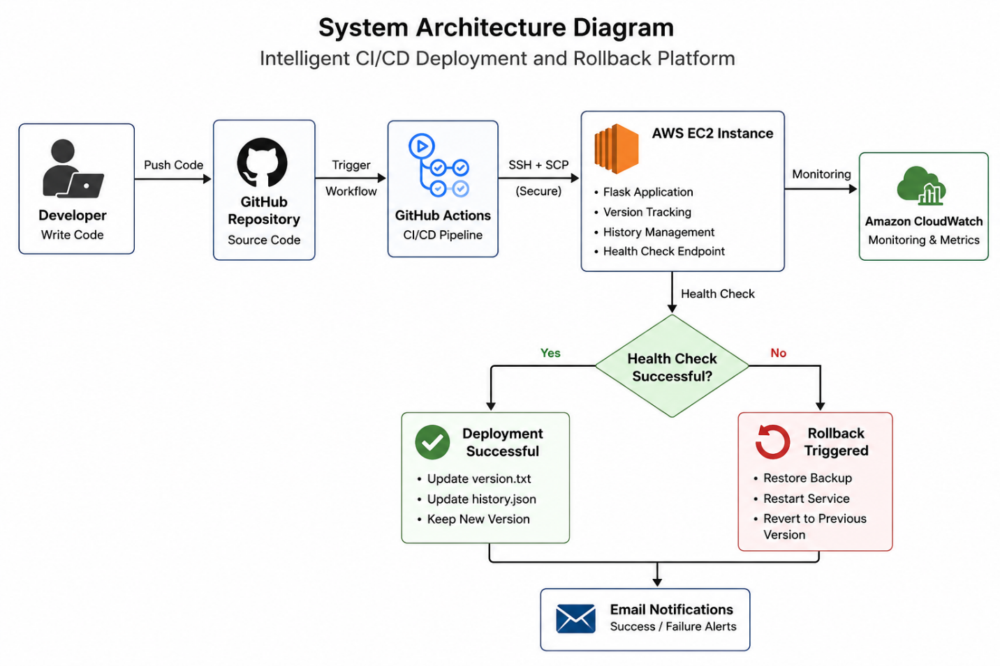

# Smart CI/CD Platform 🚀
## Intelligent CI/CD Deployment & Auto Rollback Platform using AWS

Smart CI/CD Platform is a cloud-based deployment automation system built using Flask, GitHub Actions, and AWS EC2.

It automates the complete software delivery pipeline, including Continuous Integration (CI), Continuous Deployment (CD), health monitoring, deployment tracking, and automatic rollback when deployment failures are detected.

---

## Features

- Automated CI/CD pipeline using GitHub Actions
- AWS EC2 deployment integration
- Automatic rollback on deployment failure
- Health monitoring using a dedicated health check endpoint
- Deployment dashboard built with Flask
- Deployment history tracking
- Backup of previous stable version before deployment
- Version tracking and deployment analytics
- Secure deployment using GitHub Secrets

---

## System Architecture



### Deployment Flow

```text
Developer
   │
   ▼
GitHub Repository
   │
   ▼
GitHub Actions (CI/CD Pipeline)
   │
   ├── Backup Current Version
   ├── Deploy New Code to EC2
   ├── Run Health Check
   └── Auto Rollback if Failed
   │
   ▼
AWS EC2 Server
   │
   ▼
Flask Application
```

---

## Tech Stack

### Backend
- Python
- Flask
- Gunicorn

### Cloud & DevOps
- AWS EC2
- GitHub Actions
- Bash Scripting

### Frontend
- HTML
- CSS

---

## Project Structure

```text
smart-cicd-platform/
│
├── .github/
│   └── workflows/
│       └── deploy.yml
│
├── scripts/
│   ├── start_server.sh
│   ├── stop_server.sh
│   └── health_check.sh
│
├── templates/
│   ├── index.html
│   └── history.html
│
├── app.py
├── appspec.yml
├── requirements.txt
├── version.txt
├── analytics.json
├── history.json
├── .gitignore
└── README.md
```

---

## How the CI/CD Pipeline Works

1. Developer pushes code to the `main` branch.
2. GitHub Actions workflow is automatically triggered.
3. Current application version is backed up on the EC2 server.
4. New code is transferred and deployed.
5. The application starts using Gunicorn.
6. A health check request is sent to the application.
7. If the health check succeeds, deployment is completed.
8. If the health check fails, the previous stable version is restored automatically.

---

### Process

- Before deployment, the current working version is backed up.
- After deployment, the application health is verified.
- If deployment validation fails:
  - The newly deployed version is removed.
  - The previous stable backup is restored.
  - The application is restarted automatically.

This minimizes downtime and helps maintain service availability.

---

## Health Check Endpoint

The application provides a dedicated endpoint for deployment verification.

---

## Installation

### Clone the Repository

```bash
git clone https://github.com/zubair-fakhar/smart-cicd-platform.git
cd smart-cicd-platform
```

### Install Dependencies

```bash
pip install -r requirements.txt
```

### Run the Application

```bash
python app.py
```

Open:

```text
http://127.0.0.1:5000
```

---

## AWS Deployment Configuration

### Required GitHub Secrets

Navigate to:

```text
Repository Settings → Secrets and Variables → Actions
```

Create the following secrets:

| Secret Name | Description |
|------------|-------------|
| EC2_HOST | AWS EC2 Public IP |
| EC2_USER | EC2 Username (usually ubuntu) |
| EC2_SSH_KEY | Private SSH Key (.pem contents) |

---

## Deployment Dashboard

The platform includes a web-based dashboard that displays:

- Current application version
- Deployment status
- Successful deployments
- Failed deployments
- Rollback statistics
- Deployment history

---

## Deployment History

Deployment records are stored and displayed through the history module.

Tracked information includes:

- Version number
- Deployment status
- Deployment timestamp
- Rollback events

---

## Author

**Zubair Fakhar**
