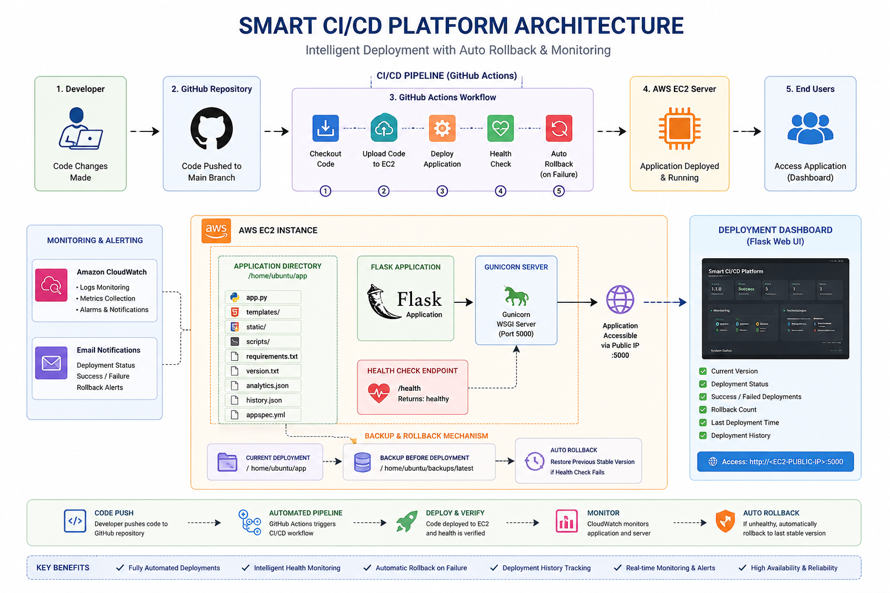

# 🚀 Smart CI/CD Platform

## Intelligent CI/CD Deployment & Auto Rollback Platform using AWS

Smart CI/CD Platform is a cloud-based deployment automation system designed to streamline software delivery through Continuous Integration and Continuous Deployment (CI/CD). The platform automatically deploys application updates to an AWS EC2 instance, validates deployment health, tracks deployment history, and automatically restores the last stable version if a deployment failure is detected.

The project demonstrates practical implementation of modern DevOps practices, cloud infrastructure management, deployment automation, and failure recovery strategies using AWS and GitHub Actions.

---

# 📌 Project Overview

Deploying applications manually can be time-consuming and error-prone. A failed deployment can result in service downtime, affecting both users and business operations.

This project addresses these challenges by providing an automated deployment pipeline that:

* Automatically deploys application updates
* Monitors deployment health
* Tracks deployment analytics and history
* Creates backups before every deployment
* Automatically rolls back failed deployments
* Reduces manual intervention and downtime

---

# 🚀 Features

* ✅ Automated CI/CD Pipeline using GitHub Actions
* ✅ AWS EC2 Deployment Automation
* ✅ Automated Health Monitoring
* ✅ Auto Rollback on Deployment Failure
* ✅ Backup of Previous Stable Version
* ✅ Deployment Dashboard
* ✅ Deployment History Tracking
* ✅ Version Management
* ✅ Secure Deployment using GitHub Secrets
* ✅ Production Deployment using Gunicorn

---

# ☁️ Cloud Infrastructure

The platform is deployed on AWS and utilizes:

### AWS EC2

Provides the cloud infrastructure required to host and run the application.

### GitHub Actions

Automates the entire deployment workflow from code push to production deployment.

### GitHub Secrets

Securely stores deployment credentials such as:

* EC2 Host
* EC2 Username
* SSH Private Key

### Gunicorn

Acts as the production-grade WSGI server responsible for serving the Flask application on the EC2 instance.

---

# 🔄 CI/CD Pipeline Workflow

The deployment process follows these steps:

1. Developer pushes code to the main branch.
2. GitHub Actions automatically triggers the workflow.
3. Current application version is backed up.
4. Updated code is transferred to AWS EC2.
5. Application is restarted using Gunicorn.
6. Health validation is performed through the health endpoint.
7. If validation succeeds, deployment is completed.
8. If validation fails, automatic rollback restores the previous stable version.

---

# 🧠 Auto Rollback Mechanism

One of the core features of the platform is its intelligent rollback capability.

### Deployment Success

```text
Code Push
    ↓
Deploy New Version
    ↓
Health Check Passed
    ↓
Deployment Successful
```

### Deployment Failure

```text
Code Push
    ↓
Deploy New Version
    ↓
Health Check Failed
    ↓
Restore Previous Backup
    ↓
Restart Application
```

This ensures application availability even when deployment issues occur.

---

# ❤️ Health Monitoring

The platform continuously validates deployment success through a dedicated endpoint.

### Health Endpoint

```text
/health
```

Expected Response:

```text
healthy
```

The CI/CD pipeline uses this endpoint to verify that the application is functioning correctly after deployment.

---

# 📊 Deployment Dashboard

The Flask dashboard provides deployment insights including:

* Current Version
* Deployment Status
* Successful Deployments
* Failed Deployments
* Rollback Statistics
* Last Deployment Information

This allows users to monitor deployment activity through a simple web interface.

---

# 📜 Deployment History Tracking

The platform maintains deployment records for monitoring and auditing purposes.

Tracked information includes:

* Version Number
* Deployment Status
* Deployment Timestamp
* Rollback Events

This enables visibility into previous deployment activities.

---

# 🛠️ Technologies Used

## Programming Language

* Python

## Backend Framework

* Flask

## DevOps & Automation

* GitHub Actions
* Bash Scripting

## Cloud Platform

* AWS EC2

## Application Server

* Gunicorn

## Frontend

* HTML
* CSS

---

# 📂 Project Structure

```text
smart-cicd-platform/
│
├── .github/
│   └── workflows/
│       └── deploy.yml
│
├── scripts/
│   ├── start_server.sh
│   ├── stop_server.sh
│   └── health_check.sh
│
├── templates/
│   ├── index.html
│   └── history.html
│
├── app.py
├── appspec.yml
├── requirements.txt
├── version.txt
├── analytics.json
├── history.json
├── LICENSE
├── .gitignore
└── README.md
```

---

# 🏗️ System Architecture



---

# 🔐 Security

Deployment credentials are not stored in the source code.

Sensitive information is managed using GitHub Secrets, ensuring secure deployment and preventing credential exposure.

Protected values include:

* EC2 Host
* EC2 Username
* SSH Private Key

---

# 🚀 Reproducing the Project

### Clone Repository

```bash
git clone https://github.com/zubair-fakhar/smart-cicd-platform.git
cd smart-cicd-platform
```

### Install Dependencies

```bash
pip install -r requirements.txt
```

### Run Application

```bash
python app.py
```

---

# 👨‍💻 Author

**Muhammad Zubair**

---

If you found this project useful, consider giving it a ⭐ on GitHub.
